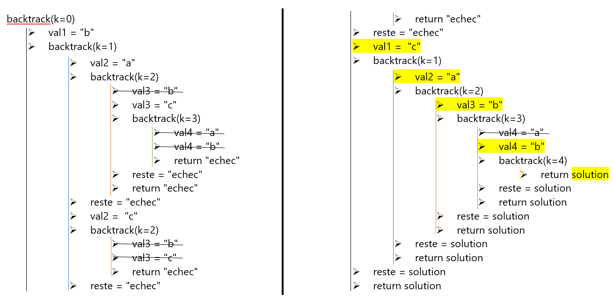
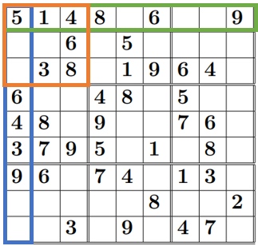

Implémentation en python
########################

Maintenant que les notions théoriques de la programmation par contraintes ont
été abordées, nous pouvons implémenter notre algorithme de résolution de sudoku 
en python.

Modélisation des variables et des contraintes
=============================================

Tout d'abord, nous allons modéliser les variables et les contraintes d'un PSC 
en créant leurs classes respectives. Cette section est inspirée en partie de :cite:`Ia_par_la_pratique`.

Premièrement, nous définissons la classe :code:`Variable` : elle possède les attibuts :code:`nom`, :code:`domaine`,
:code:`valeur` (actuelle) et :code:`label`, qui est initalement une copie du domaine.
De plus, elle contient plusieurs méthodes : :code:`metAJourValeur` met à jour la valeur de la variable, 
:code:`enleve_du_label` supprime la valeur rentrée en paramètre
du label et :code:`__repr__` retourne le nom de la variable, son domaine et sa 
valeur dans une chaîne de caractère.

..  literalinclude:: scripts/algorithme_sudokus.py
    :lines: 5-21
    :linenos:
 
Deuxièmement, la classe :code:`Contrainte` doit aussi être définie. Cependant, elle ne sera jamais directement utilisée
et sera héritée par les classes plus spécifiques :code:`ContrainteUnaire` et :code:`ContrainteBinaire` : il s'agit donc
d'une classe abstraite. Son attribut 
:code:`variables` contient la liste des variables sur lesquelles porte la contrainte et
:code:`dimension` détermine 
le nombre de variables sur lesquelles elle agit. La méthode
:code:`estValide` teste si la contrainte est respectée en choisissant la 
valeur :code:`val` pour la variable :code:`var` et :code:`__repr__` retourne 
la représentation sous format :code:`str` de la contrainte.

..  literalinclude:: scripts/algorithme_sudokus.py
    :lines: 23-34
    :linenos:

Désormais, nous devons donc modéliser la classe fille :code:`ContrainteUnaire` qui s'applique aux contraintes portant
sur une seule variable. La liste des variables ne contiendra donc que le nom de la variable impliquée dans la contrainte 
:code:`refVar` prise en paramètre lors de l'instanciation et la dimension vaudra logiquement 1.
Cette classe contient également les attributs :code:`op`, l'opérateur de la contrainte
(<,<=,>,>=,==,!=), la valeur de référence pour l'opérateur :code:`ref`, et la variable :code:`refVar`. Puis, on redéfinit les méthodes
de la classe :code:`Contrainte` : :code:`dimension` retourne logiquement 1 et :code:`__repr__` retourne la variable impliquée,
l'opérateur et la valeur de référence. Pour la méthode :code:`estValide`, on doit d'abord stocker la valeur actuelle de la variabe 
et la mettre à jour avec la valeur rentrée en paramètre. Ensuite, on teste cette valeur par rapport 
à l'opérateur et à la valeur de référence. Finalement, il faut remettre à jour la valeur initiale de la variable.

..  literalinclude:: scripts/algorithme_sudokus.py
    :lines: 43-77
    :linenos:

On implémente la classe :code:`ContrainteBinaire` de manière semblable à la classe :code:`ContrainteUnaire`. Cette fois, 
la liste des variables contiendra les noms des variables :code:`refVar1` et :code:`refVar2`. Les attributs sont ces deux variables ainsi
que l'opérateur :code:`op` et la dimension de ces contraintes est de 2. Le fonctionnement des méthodes reste le même
à la différence que la valeur de référence :code:`ref` est remplacée par la valeur de la variable :code:`refVar2` dans la méthode
:code:`estValide`.

..  literalinclude:: scripts/algorithme_sudokus.py
    :lines: 79-113
    :linenos:

A présent, il s'agit d'implémenter la classe :code:`PSC` qui gère l'ensemble d'un problème 
de satisfaction de contraintes. Elle possède les attributs suivants :
:code:`variables` qui contient la liste des variables, le dictionaire 
:code:`noms_variables` ayant pour clés les noms des variables et pour valeurs les 
variables elles-mêmes, les listes :code:`contraintes_binaires` et :code:`contraintes_unaires`
contenant toutes les contraintes du PSC. Puis,
on utilise la méthode :code:`ajouteVar` qui ajoute la 
variable :code:`var` dans :code:`variables`et qui remplit
:code:`noms_variables`. Puis, :code:`retourneVar` permet de retourner 
une variable d'après son nom. La méthode :code:`__repr__` quant à elle retourne une chaîne de caractères contenant toutes
les informations sur chaque variable.

..  literalinclude:: scripts/algorithme_sudokus.py
    :lines: 139-162, 173-178
    :linenos:

Comme pour les variables, on définit également une classe :code:`Contraintes` qui s'occupe de l'ensemble des contraintes 
du PSC. Ses attributs :code:`contraintes` et :code:`contraintes_noms` contiennent toutes les contraintes et leur nom et sont 
également vides au départ. Lorsqu'une contrainte est ajoutée avec :code:`ajouteContrainte`, on doit donc aussi rajouter 
son nom dans la liste :code:`contraintes_noms`. Finalement, la méthode :code:`__repr__` est semblable à celle de la classe 
:code:`Variables`.

..  literalinclude:: scripts/algorithme_sudokus.py
    :lines: 180-187, 199-204
    :linenos:

Algorithme de backtracking
==========================

Aprés avoir défini ces quatre classes, nous pouvons implémenter l'algorithme de recherche en profondeur d'abord 
dans la fonction :code:`backtrack`. D'abord, le premier paramètre :code:`k` correspond à l'indice de la variable actuelle 
sur laquelle on teste les valeurs, valant initalement 0. Lorsqu'on teste les valeurs de la variable suivante, on rappelle la fonction
avec :code:`k+1` en paramètre : cette fonction est donc récursive. Mais avant d'être rappelée, elle fait appel à la 
fonction :code:`consistance_avec_vars_precedentes` qui est au coeur du fonctionnement de l'algorithme. Elle passe en revue 
toutes les contraintes portant sur la variable d'indice :code:`k` et sur les variables d'indice plus petit que :code:`k`
précédemment instanciées et teste si la combinaison des valeurs attribuées est consistante, c'est à dire si elle 
respecte ces contraintes. C'est donc seulement si toutes ces contraintes sont respectées qu'on peut passer à l'attribution
de la valeur de la variable d'indice :code:`k+1`. Si le programme arrive à donner une valeur à la dernière variable
qui est consistante avec toutes les valeurs des autres variables, cela signifie qu'on a trouvé une solution au problème et on 
retourne un dictionnaire contenant les noms des variables et leur valeur. Cependant, si aucune combinaison ne 
fonctionne, l'algorithme retourne "echec".

..  literalinclude:: scripts/algorithme_sudokus.py
    :lines: 222-260
    :linenos:

Afin de mieux comprendre l'algorithme de backtracking, prenons l'exemple du PSC de la 
:numref:`reseau`. Tout d'abord, il s'agit d'instancier les différentes variables et contraintes :
par exemple on a le code suivant pour la première variable : :code:`x1 = Variable("x1", ["b","c"])`, et pour la 
contrainte entre la variable :code:`x1` et :code:`x2` on a ceci : :code:`c12 = Contrainte_binaire(x1,"!=",x2)`. Après 
avoir ajouter toutes nos variables et contraintes dans les instances des classes :code:`Variables` et 
:code:`Contraintes`, nous pouvons exécuter l'algorhitme de backtracking, représenter par la 
pseudo-exécution suivante dans laquelle les assignations des valeurs solutions sont représentées 
en jaune :

    
    Pseudo-exécution de l'algorithme de backtracking du PSC de la :numref:`reseau`

Algorithme de forward checking
=============================

Il s'agit maintenant d'implémenter l'algorhitme de forward checking dont
la structure récursive est la même que pour le backtracking. A chaque
niveau :code:`k`, on commence par définir la variable actuelle et par
effectuer une copie des labels actuels dans la variable :code:`anciens_labels`
grâce à la fonction :code:`retourne_labels`. Ensuite, on a le même code
que la fonction :code:`backtrack` mais :code:`consistance_avec_vars_precedentes`
est remplacée par :code:`propage_aux_vars_suivantes`. Cette fonction regarde
pour chaque contrainte si une variable d'indice plus grand que :code:`k`
est l'une des variables sur laquelle la contrainte s'applique. Si c'est le cas,
on utilise la méthode de la classe :code:`Contrainte propage`. Cette dernière
supprime les valeurs inconsistantes par rapport à la contrainte du label
de la variable et à la fin, on retourne :code:`True` si le label contient
encore des valeurs et :code:`False` s'il est vide. Ainsi, si le label
n'est pas vide après la propagation, on peut continuer la propagation
avec les contraintes suivantes. Sinon, on s'arrête et on retourne :code:`False`
, car on ne peut pas continuer la recherche avec un label vide, et on remet 
à jour les labels avec la variable :code:`anciens_labels` et la fonction
:code:`met_a_jour_labels`.

..  literalinclude:: scripts/algorithme_sudokus.py
    :lines: 51-58, 262-307
    :linenos:

Application à la résolution de sudokus
======================================

Afin de résoudre des sudokus à l'aide de l'algorithme de backtrack précédemment implémenté, nous
devons définir les variables, leurs domaines et les contraintes du problème. Les variables correspondent
aux cases vides des grilles de sudokus. Leur domaine est le même pour toutes et est les nombres entre 1 
et la taille de la grille (9 habituellement). Ce sont des contraintes d'inégalités qui définissent
les relations des variables entre elles et des variables avec les cases déjà numérotées : chaque case
d'une même ligne, d'une même colonne ou d'un même carré ne doit pas avoir la même valeur qu'une autre.

La fonction que nous allons développer prend en paramètre une grille sous forme de liste de listes qui sont 
les lignes de la grille, avec des "x" pour les valeurs inconnues, et retourne la grille complétée sous 
le même format.

La première étape consiste alors à implémenter les fonctions *lignes*, *colonnes* et *carres* qui
retournent des listes de listes qui sont les lignes, colonnes ou carrés de la grille.

Pour illustrer cela, voici ci-dessous une grille de sudokus qui correspond à la liste
:code:`[[5,1,4,8,x,6,x,x,9],
[x,x,6,x,5,x,x,x,x],
[x,3,8,x,1,9,6,4,x],
[6,x,x,4,8,x,5,x,x],
[4,8,x,9,x,x,7,6,x],
[3,7,9,5,x,1,x,8,x],
[9,6,x,7,4,x,1,3,x],
[x,x,x,x,x,8,x,x,2],
[x,x,3,x,9,x,4,7,x]]` (les :code:`x` sont en réalité des :code:`"x"`) :

    
    Exemple de sudoku tiré de :cite:`1000_sudokus`

En vert est mise en évidence la première ligne de la liste retournée par la fonction :code:`lignes`,
représentée par la liste :code:`[5,1,4,8,x,6,x,x,9]`, en
bleu la première colonne de la fonction :code:`colonnes` représentée par la liste 
:code:`[5,x,x,6,4,3,9,x,x]` et en orange le premier carré de la fonction 
:code:`carres` représenté par la liste :code:`[5,1,4,x,x,6,x,3,8]`.

..  literalinclude:: scripts/algorithme_sudokus.py
    :lines: 271-293
    :linenos:

Ensuite, à partir de la grille de sudoku, on peut créer les variables pour chaque case contenant un 
"x". Leur nom est composé de l'indice :code:`i` de la ligne et de l'indice :code:`j` de la colonne d'où elles se 
trouvent dans la grille. En plus de créer ces variables et de les ajouter à la liste des variables,
contenue dans une instanciation de la classe :code:`Variables`, on remplace également les "x" de la grille
par les noms des variables.

..  literalinclude:: scripts/algorithme_sudokus.py
    :lines: 295-303
    :linenos:

Pour instancier les contraintes, on implémente la fonction :code:`creation_des_contraintes` qui prend dans le
paramètre :code:`grille` soit la liste des lignes, soit celle des colonnes, soit celle des carrés générées par
les fonctions précédemment définies. Pour chaque case qui contient un nom de variable, on crée les
contraintes unaires portant sur cette variable (par rapport aux cases de la même "ligne" 
contenant un chiffre) et les contraintes binaires portant sur elle et une autre variable de la "ligne". 
De plus, afin d'éviter de créer des contraintes identiques, une copie de la ligne actuelle :code:`ligne2` est 
créée et lorsqu'on instancie les contraintes d'une variable, on la supprime de :code:`ligne2`.
On contrôle également que chaque contrainte ne se trouve pas déjà dans la liste
des contraintes (cette étape est surtout nécessaire lorsqu'on rajoute les contraintes issues des carrés qui 
ont souvent déjà été ajoutées lors des appels de la fonction avec les lignes et les colonnes).

..  literalinclude:: scripts/algorithme_sudokus.py
    :lines: 306-322
    :linenos:

Puis, la fonction :code:`creation_de_toutes_les_contraintes` génère l'ensemble des 
contraintes en appelant d'abord la fonction :code:`creation_des_variables` pour  
instancier les variables et créer la nouvelle grille contenant le nom de ces
dernières, ainsi qu'en créant 
les listes des lignes, colonnes et carrés avec lesquelles peuvent être générées 
toutes les contraintes. 

..  literalinclude:: scripts/algorithme_sudokus.py
    :lines: 324-334
    :linenos:

Finalement, il est l'heure de définir la fonction :code:`solution_sudoku` qui peut
résoudre tout sudoku réalisable. On commence par créer des instances des classes
:code:`Contraintes` et :code:`Variables`. Ensuite, on contrôle que la grille de sudoku 
est dans les normes avec la fonction :code:`grille_valide`, qui vérifie si chaque ligne
a le même nombre d'éléments que la grille a de lignes. 
Puis, on appelle la fonction :code:`creation_de_toutes_les_contraintes` qui appelle
aussi la fonction :code:`creation_des_variables`. On peut ensuite utiliser l'algorithme
de recherche en profondeur d'abord :code:`backtrack` qui prend en paramètre la grille ainsi
que les listes de variables et de contraintes. Si la recherche a été fructueuse, on
insère les valeurs valides des variables dans la grille et on l'imprime, sinon on 
imprime un message indiquant que le sudoku ne peut pas être résolu, ce qui signifie
qu'il n'a pas été généré correctement.

..  literalinclude:: scripts/algorithme_sudokus.py
    :lines: 260-270, 339-359
    :linenos: