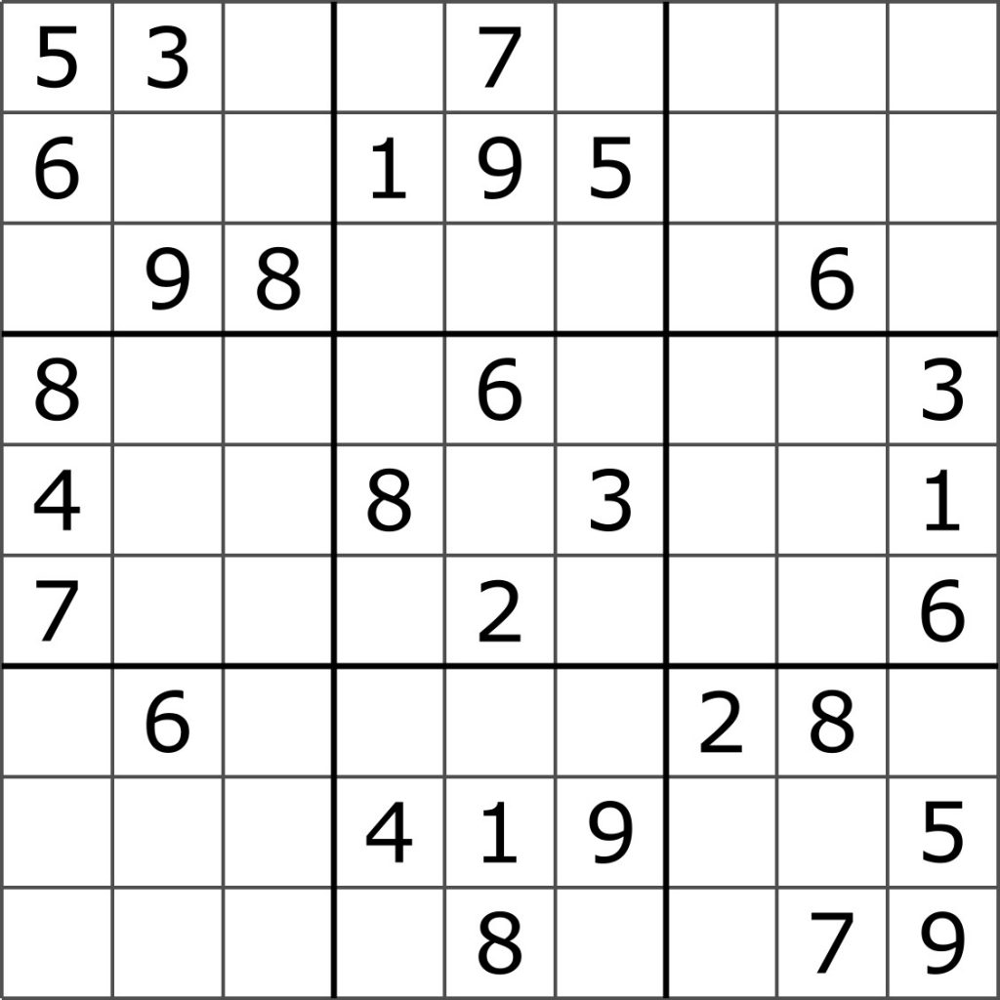

.. _introduction.rst:

Introduction
############

Résoudre un sudoku demande de la patience et de
la stratégie et il n'est pas toujours évident
d'en trouver la solution. Ce jeu basé sur la logique
est pourtant constitué de règles assez simples : il faut
remplir la grille avec comme uniques contraintes que les
chiffres des cases soient différents sur chaque ligne, chaque collone
et chaque carré. A la place de résoudre ces 
problèmes manuellement, il peut être intéressant
de coder un programme informatique capable de trouver
une solution pour chaque grille de sudoku.

Ce travail personnel a donc pour but de parvenir à
coder un tel programme. Et pour y parvenir, comme les règles des sudokus
sont en fait des contraintes s'appliquant sur chaque case, le paradigme de
programmation utilisé sera celui de la programmation par contraintes.
Cela me permettra de découvrir une nouvelle manière de conceptualiser
un problème informatique de manière théorique et d'ensuite appliquer
ces notions dans un cas pratique de la vie de tous les jours.

D'abord, il s'agira donc de s'intéresser à ce qu'est en théorie 
la programmation par contraintes et à ses principes de bases ainsi
que ses méthodes de résolution de problèmes. Ensuite viendra 
l'implémentation en language python de ces notions pour créer
un programme de résolution de sudokus. Finalement, on comparera
l'efficacité des différents algorithmes implémentés afin de mettre
en évidence les avantages de certaines méthodes.