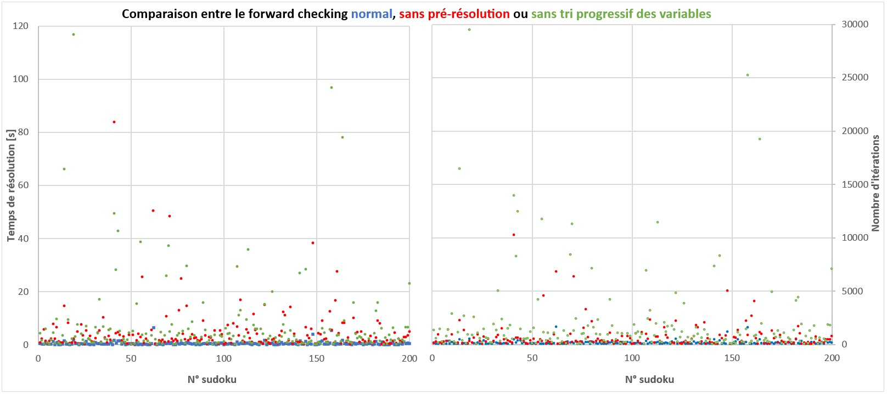

Comparaison des performances des algorithmes
############################################

Cette section vise à tester les algorithmes définis dans la section 
précédente et à montrer leur efficacité. Pour cela, nous allons 
nous aider d'un générateur de sudokus qui se trouve sur le site 
https://qqwing.com/generate.html et résoudre un grand nombre de grilles
différentes. Les grilles générées sont stockées dans un fichier .txt et il 
faut donc tout d'abord extraire toutes les grilles dans une liste de grilles.
Voici un exemple de deux grilles dans le format généré :

..  literalinclude:: scripts/sudokus.txt
    :lines: 1-20

Pour extraire toutes les grilles, on utilise d'abord la fonction :code:`open`
et la méthode :code:`readlines` qui crée une liste avec une chaine caractères
pour chaque ligne du fichier. 

..  literalinclude:: scripts/algorithme_sudokus.py
    :lines: 429-433
    :linenos:

Ensuite, on définit la fonction 
:code:`lines_to_sudokus` qui prend en paramètre la liste ainsi extraite.

..  literalinclude:: scripts/algorithme_sudokus.py
    :lines: 390-404
    :linenos:

Comparaison entre le backtracking et le forward checking
========================================================

Désormais, nous allons comparer les algorithmes de backtracking et de forward checking
grâce à une fonction qui calcule le temps de résolution et le nombre
d'itérations (d'appels récursifs des algorithmes) pour chaque grille générée avec
chacune des deux méthodes. Elle imprime ces deux valeurs et l'ensemble de toutes
les valeurs imprimées sont ensuite copiées dans un document Excel. Voici donc la fonction
:code:`chronometre` qui utilise la fonction :code:`timer` du module :code:`timeit` :

..  literalinclude:: scripts/algorithme_sudokus.py
    :lines: 406-427
    :linenos:

1000 sudokus ont été générés et ci-dessous se trouve d'abord le graphique Excel 
contenant les résultats pour l'algorithme de forward checking, les points en
bleu correspondent aux nombre de secondes nécessaires à mon ordinateur pour la résolution des
sudokus et en orange le nombre d'itérations :

On remarque que globalement, les valeurs mesurées sont à peu prés les mêmes et bien plus
petites que le maximum de 8.034 secondes et 2526 itérations. En effet, la moyenne
de temps se situe à 0.5141 seconde, la valeur médiane à 0.3084 secondes et la moyenne du nombre
d'itérations est de 167, la valeur médiane de 106. Donc globalement, l'algorithme est bien efficace
et seules quelques exceptions sont résolues avec plus de difficultés.

Maintenant, intéressons-nous aux résultats obtenus avec la méthode du backtracking, qui est
comme on va le voir nettement moins performante, c'est pourquoi le nombre de sudokus résolus a
été réduit à 200, la résolution prenant parfois beaucoup de temps.

Les moyennes pour cet algorithme sont cette fois-ci de 38 secondes et
de 85232 itérations. Cependant, ces valeurs sont autant grandes à cause de 
l'importante influence de certains sudokus, comme le 148ème 
qui a pris 1 heure et 18 minutes à être résolu et qui
a nécessité 9'416'766 itérations. Les valeurs médianes sont donc plus
indicatives : 2.193 secondes et 5975 itérations. Celles-ci sont néanmoins
largement plus élevées que celles de la méthode du forward_checking. 

Ces résultats sont donc la preuve que le forward checking est beaucoup 
plus efficace que le retour-arrière. On pourrait penser à premier abord
qu'il serait plus lent à cause des étapes de propagation d'une affectation
de valeur à une variable aux variables suivantes et de tri progressif
de la liste des variables qui rallongent le temps de chaque itération. En
effet, on peut calculer la valeur moyenne du temps d'exécution de chaque
itération en divisant le temps de résolution par le nombre d'exécutions et
les résultats sont les suivants : pour le forward checking, le temps 
d'exécution moyen d'une itération est de 2.86 millisecondes alors que pour
le backtracking il est de 0.37 milliseconde. Cependant, même si ces étapes
supplémentaires rallongent chaque itération, elle permettent surtout de 
limiter le nombre d'itérations à l'avance pour ne pas avoir à aller 
jusqu'au bout de chaque branche de l'arbre de recherche comme le fait 
le backtracking. C'est là l'avantage principal de cette méthode mettant
en évidence un atout de la programmation par contraintes : on réduit les
possibilités de solutions au fur et à mesure et à l'avance en réduisant 
petit à petit les labels des variables. Le retour-arrière quant à lui 
n'a pas cette capacité de réduction d'espace de solutions  : les retours en arrière s'effectuent lorsqu'aucune
valeur du domaine d'une variable n'est consistante par rapport aux variables déjà instanciées.
On doit donc tester chaque valeur du domaine. Avec 
le forward checking, on retourne en arrière quand une variable non 
encore instanciée ne possède plus de valeurs
dans son label, donc plus de valeurs consistantes dans son domaine.

On peut quand même remarquer que pour 15 des 200 sudokus résolus par
les deux méthodes, le backtracking est légèrement plus rapide que 
le forward checking : on peut expliquer cela par des grilles avec une
configuration avantageuse où la solution se trouve dans les premières
branches de l'arbre de recherche. Cependant, dans aucunes des grilles 
le nombre d'itérations est plus petit avec le retour-arrière.

Comparaison entre le forward checking normal, sans pré-résolution et sans tri progressif des variables
=====================================================================================================

Maintenant, nous allons analyser l'influence qu'on les algorithmes secondaires dans une résolution
de sudoku avec l'algorithme de forward checking. Nous allons remesurer le temps d'exécution et le 
nombre d'itérations dans deux nouvelles situations : la première sans effectuer les réductions
de labels avant la résolution avec les méthodes :code:`consistance_noeuds` et
:code:`consistance_arcs` ainsi que sans trier les variables avec la méthode
:code:`sort_variables`. La deuxième séries de mesures s'effectuera elle sans le tri progressif 
des variables au sein du forward checking avec la méthode :code:`dynamic_ordering`. Voici les
résultats trouvés :

On remarque que sans ces algorithmes secondaires, les résolutions sont bien moins efficaces. Premièrement,
en enlevant les méthodes de pré-résolution, on a des labels plus grands au début et des variables non
triées, ce qui rend la résolution plus aléatoire et le chemin sur l'arbre de recherche plus long.
Mais c'est l'absence du :code:`dynamic_ordering` qui a la plus grande influence : la moyenne
des temps de résolution est de 8.23 secondes, la valeur médiane de 2.68 secondes et la moyenne
du nombre d'itérations vaut 2230, la valeur médiane 786 tandis que sans la pré-résolution ces valeurs
valent respectivement 4.36 secondes, 2.19 secondes, 636 et 329. Ces résultats sont explicables
par le fait que choisir les variables avec les plus petits labels en cours de résolution permet
encore plus d'éviter de prendre un chemin aléatoire. De plus, même si les variables sont triées au
départ, elles perdent leur ordre à chaque propagation d'une assignation de valeur et c'est le 
:code:`dynamic_ordering` qui empêche cela.

Cette analyse a donc permis de montrer que la méthode de résolution utilisée dans le programme
n'est pas uniquement efficace grâce à son algorithme de base mais également avec l'aide 
d'autres algorithmes qui lui sont complémentaires et qui change radicalement le temps 
d'exécution et le nombre d'itérations nécessaires.