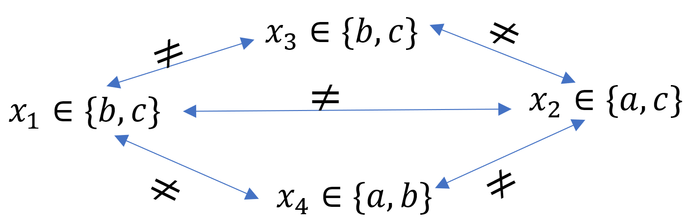
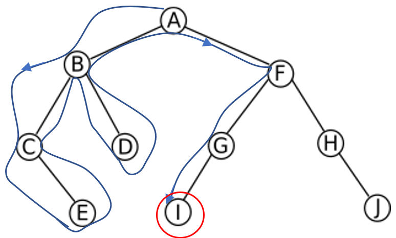

.. module:: sphinx.ext.mathbase

Notions théoriques de la programmation par contraintes
######################################################

Tout d'abord, il s'agit de présenter les éléments et notions théoriques de la programmation 
par contraintes nécessaires à l'implémentation d'un algorithme de résolution de sudokus.

Notions de bases
================

Qu'est-ce que la programmation par contraintes ? Ce paradigme est une façon de résoudre des 
problèmes décrits par un ensemble de variables sur lesquelles agissent des contraintes. Une 
solution à ces problèmes consiste à affecter à chaque variable une valeur respectant les contraintes.
Chaque variable possède un domaine qui contient toutes les valeurs qu'elle peut admettre. Les 
contraintes quant à elle peuvent concerner une seule variable dans le cas des contraintes unaires,
deux variables dans le cas des contraintes binaires ou plus dans le cas des contraintes multiples.
Ainsi, un problème de satisfaction de contraintes (PSC) se définit de la manière suivante :

- L'ensemble de variables :math:`{\chi} = \{x_1, x_2, ..., x_n \}`.
- L'ensemble des domaines associés aux variables : :math:`D = \{d_1, d_2, ..., d_n \}`.
- L'ensemble des contraintes qui portent sur les variables : :math:`C = \{c_1, c_2, ..., c_n \}`.

Représentation d'un PSC
=======================

Une manière simple de visualiser et de comprendre de tels problèmes est la représentation par 
un réseau de contraintes dans lequel les noeuds correspondent aux variables et les arcs correspondent
aux contraintes. Voici par exemple un réseau de contraintes binaires contenant quatre 
variables :math:`x_1, x_2, x_3` et :math:`x_4`, leur domaines respectifs :math:`d_1 = \{b,c\}, d_2 = \{a,c\}, d_3 = \{b,c\}`
et :math:`d_4 = \{a,b\}` ainsi que les contraintes d'inégalité les reliant:

    
    Réseau de contraintes binaires

Méthodes de résolution
======================

Il existent diverses méthodes de résolution des problèmes de satisfaction de contraintes à l'aide 
d'algorithmes de recherche où l'on énumère toutes les combinaisons possibles de valeurs pour 
les variable jusqu'à trouver celles respectant toutes les contraintes. 

Dans ce travail, nous nous intéresserons uniquement aux méthodes basées
sur la recherche en profondeur d'abord, aussi appelée backtrack : dans un 
schéma arborescent, on explore chaque branche jusqu'au bout avant de remonter et d'explorer les
autres branches. Dans la figure 2, on commence par le noeud A et on explore ensuite les autres noeuds
en descendant puis en remontant dans le graphe jusqu'à tomber sur la solution au noeud I.

    
    Graphe d'une recherche en profondeur

Dans un problème de satisfaction de contraintes, la profondeur des nœuds correspond au nombre de
variables satisfaisant les contraintes : on commence par tester une valeur pour une variable et on
teste les valeurs pour les autres contraintes en descendant dans l'arbre de recherche. Lorsqu’aucune des valeurs du domaine d’une variable ne 
peut coïncider avec leur contrainte, on remonte et on continue la recherche avec d’autres valeurs 
de la variable du niveau de dessus et ainsi de suite.

Le PSC de la figure 1 peut ainsi être résolu de la manière suivante (les \* représentent les 
situations où aucune valeur du domaine d'une variable ne satisfait les contraintes et on procède 
donc à un retour en arrière):

..  csv-table:: Recherche en profondeur du PSC de la figure 1
    :header: "Etape", ":math:`x_1`", ":math:`x_2`", ":math:`x_3`", ":math:`x_4`"
    :widths: 5, 10, 10, 10, 10

    1, ":math:`b`", \-, \-, \-
    2, ":math:`b`", ":math:`a`", \-, \-
    3, ":math:`b`", ":math:`a`", ":math:`c`", \-
    4, ":math:`b`", ":math:`a`", ":math:`c`", \*
    5, ":math:`b`", ":math:`a`", \*, \-
    6, ":math:`b`", ":math:`c`", \-, \-
    7, ":math:`b`", ":math:`c`", \*, \-
    8, ":math:`b`", \*, \-, \-
    9, ":math:`c`", \-, \-, \-
    10,":math:`c`", ":math:`a`", \-, \-
    11,":math:`c`", ":math:`a`", ":math:`b`", \-
    12,":math:`c`", ":math:`s`", ":math:`b`", ":math:`b`"